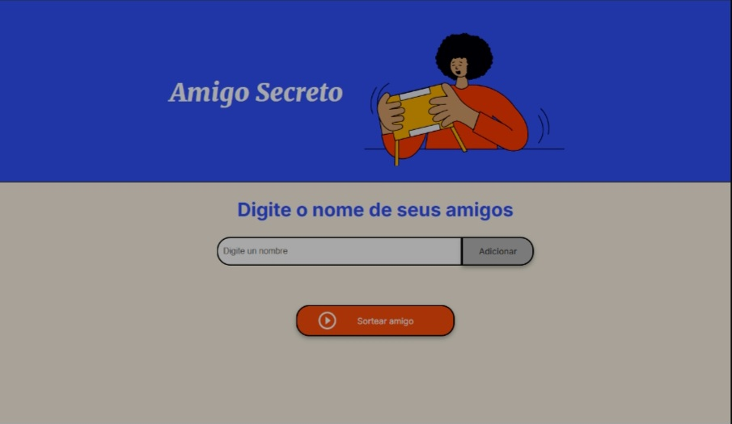

# Este projeto faz parte da minha participação no desafio Challenge da Oracle One com a Alura.#

# Amigo Secreto 🎁

Um aplicativo simples para realizar sorteios de amigo secreto de forma interativa e divertida.

## 🚀 Funcionalidades

- Adicionar até 20 amigos à lista.
- Sortear um amigo secreto por vez.
- Exibir na tela a mensagem: "O seu amigo secreto é [nome do sorteado]".
- Garantir que ninguém tire a si mesmo.
- Evitar repetições no sorteio.

### Tela Inicial



Adicione os participantes digitando os nomes e clicando no botão "Adicionar".

### Sorteio
Clique no botão "Sortear amigo" para exibir o amigo secreto de forma sequencial.

## 🛠️ Tecnologias Utilizadas

- HTML5
- CSS3
- JavaScript (DOM Manipulation)

## 📦 Como Executar o Projeto

1️⃣ **Clone o repositório:**  
```sh
git clone https://github.com/Gabbitous/Amigo-Secreto.git
```
2️⃣ **Acesse a pasta do projeto:**
```sh
cd Amigo-Secreto
```
3️⃣ **Abra o arquivo index.html no navegador.**

   **Se estiver no Windows, abra o navegador automaticamente com:**  
```sh
start index.html
```
# 📜 Licença

Este projeto é Open Source.

---

Se gostou do projeto, não esqueça de deixar uma ⭐ no repositório! 😊

